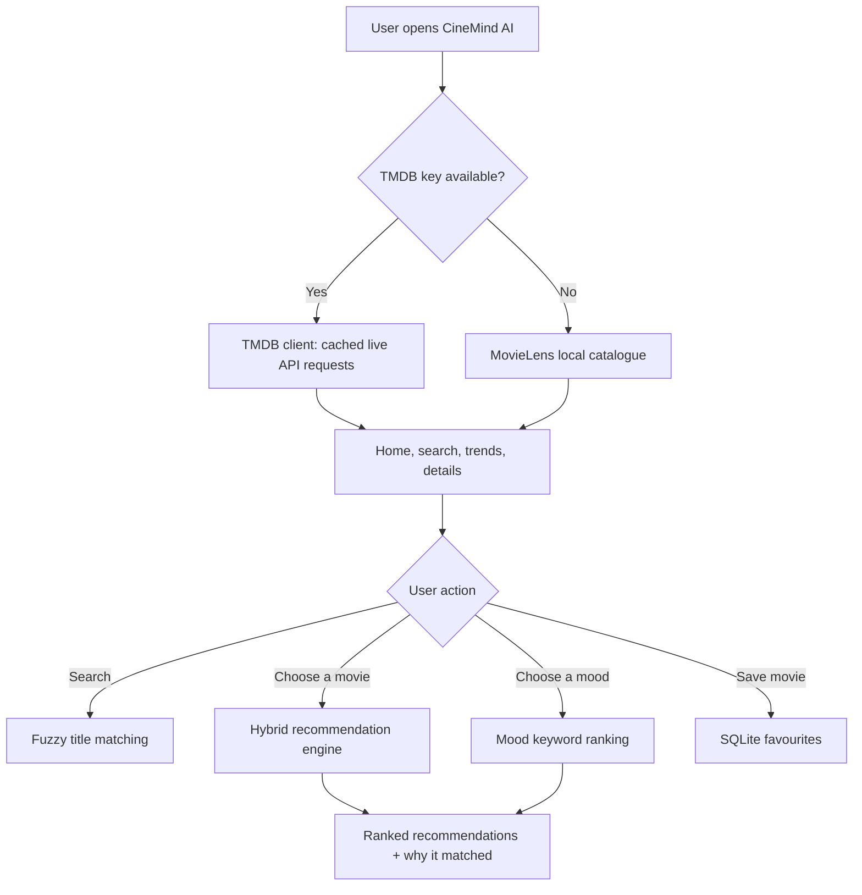
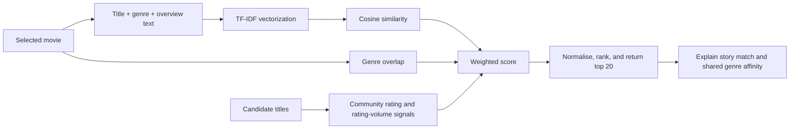

# CineMind AI

> Discover your next favorite movie with intelligent recommendations, live TMDB data, and an offline MovieLens fallback.

CineMind AI is a premium Streamlit movie-discovery application with a dark glassmorphism interface. It combines live TMDB movie information with a locally bundled MovieLens catalogue to offer search, trending lists, personalised-style similarity recommendations, mood discovery, a watchlist, and analytics.

## Highlights

- **Live movie experience** — TMDB trending, popular, top-rated, upcoming, search, cast, trailers, reviews, and India streaming-provider data.
- **Works without an API key** — 9,742 MovieLens movies and 100,836 community ratings provide offline search and recommendations.
- **Hybrid recommendations** — blends text similarity, genre affinity, rating volume, and audience ratings with transparent match explanations.
- **Fuzzy search** — handles imperfect titles using RapidFuzz, with a standard-library fallback.
- **Mood discovery** — Happy, Sad, Romantic, Action, Relaxing, Mind Blowing, Horror, and Motivational movie modes.
- **Private local watchlist** — SQLite stores favourite movies only on the running device.
- **Premium UI** — responsive dark mode, Apple-inspired glass panels, animated cards, and Plotly analytics.

## Application flow



## Recommendation flow



### Hybrid scoring

| Signal | Weight | Purpose |
| --- | ---: | --- |
| TF-IDF content similarity | 70% | Matches title, overview, and genre language |
| Genre overlap | 15% | Rewards shared genres |
| Popularity | 10% | Uses TMDB popularity or MovieLens rating volume offline |
| Audience rating | 5% | Rewards highly rated titles |

Scores are normalised before ranking. The interface shows the final match percentage and a concise recommendation reason.

## Technology stack

| Area | Technology |
| --- | --- |
| Web application | Streamlit |
| Live film data | TMDB API, Requests |
| Offline data | MovieLens latest-small |
| Recommendation ML | Pandas, NumPy, scikit-learn TF-IDF + cosine similarity |
| Fuzzy search | RapidFuzz (with `difflib` fallback) |
| Analytics | Plotly |
| Persistence | SQLite |
| Configuration | python-dotenv and Streamlit Secrets |

## Project structure

```text
CineMind-AI/
├── app.py                       # Application shell and navigation
├── components/
│   ├── movie_card.py             # Reusable movie cards and actions
│   ├── charts.py                 # Plotly chart factory
│   └── __init__.py
├── pages/
│   ├── home.py                   # Hero, search, trending and top rated
│   ├── discover.py               # AI recommendations, moods, collections
│   ├── details.py                # TMDB detail view, cast, trailer, reviews
│   └── analytics.py              # Popularity and rating visualisations
├── utils/
│   ├── api.py                    # Cached TMDB client + Streamlit Secrets support
│   ├── local_data.py             # MovieLens loading and fuzzy lookup
│   ├── recommender.py            # Hybrid and mood recommendation logic
│   ├── database.py               # SQLite favourites and search history
│   └── style.py                  # Global glassmorphism styling
├── dataset/ml-latest-small/      # Bundled MovieLens CSV data
├── .streamlit/config.toml        # Streamlit deployment theme/config
├── requirements.txt
├── runtime.txt                   # Python 3.12 for deployment
└── DEPLOYMENT.md                 # GitHub and Streamlit Cloud guide
```

## Getting started

### 1. Clone and create an environment

```powershell
git clone https://github.com/rishabhverma007/CineMind-AI.git
cd CineMind-AI
python -m venv .venv
.\.venv\Scripts\Activate.ps1
pip install -r requirements.txt
```

### 2. Configure TMDB (optional but recommended)

Copy the template and add your [TMDB API key](https://www.themoviedb.org/settings/api):

```powershell
Copy-Item .env.example .env
```

```dotenv
TMDB_API_KEY=your_tmdb_api_key
OPENAI_API_KEY=
```

`TMDB_API_KEY` unlocks live posters, trailers, cast, reviews, streaming providers, and current discovery lists. Keep `.env` private — it is excluded from Git by design.

### 3. Run locally

```powershell
streamlit run app.py
```

Open the local URL Streamlit prints (normally `http://localhost:8501`).

## Offline MovieLens mode

If no TMDB key is configured, CineMind automatically uses the included [MovieLens latest-small](https://grouplens.org/datasets/movielens/latest/) data:

- 9,742 movies
- 100,836 ratings
- 610 users
- Movie genres plus TMDB/IMDb mapping links

The app calculates per-film average ratings and rating-volume popularity, supports fuzzy title search, and produces hybrid recommendations offline. See [DATASET.md](DATASET.md) and `dataset/ml-latest-small/README.txt` for attribution and data terms.

## Deployment on Streamlit Community Cloud

1. Push this repository to GitHub.
2. Create an app on [Streamlit Community Cloud](https://share.streamlit.io/).
3. Select this repository and use `app.py` as the entry point.
4. Open **Advanced settings → Secrets** and add:

   ```toml
   TMDB_API_KEY = "your_tmdb_api_key"
   ```

5. Deploy.

The application reads credentials from local `.env` files or Streamlit Secrets. If the secret is absent, the deploy still works in offline MovieLens mode.

## Security and repository hygiene

- `.env`, Streamlit secrets, SQLite state, virtual environments, caches, logs, and editor files are ignored in `.gitignore`.
- The raw MovieLens ZIP is ignored; extracted CSV files are committed so deployed offline recommendations work immediately.
- A GitHub Actions workflow installs dependencies and compiles the app on pushes and pull requests to `main`.

## Validation completed

- Python compilation succeeds for the application, pages, components, and utilities.
- TMDB API key validation succeeds with live trending, search, details, cast, and trailer requests.
- Offline MovieLens catalogue loads all 9,742 titles and produces ranked recommendations.
- Streamlit application startup returns HTTP 200.

## License and attribution

MovieLens data is provided by GroupLens Research. Review the attribution and terms in `dataset/ml-latest-small/README.txt` before redistributing the dataset. TMDB content is subject to [TMDB terms of use](https://www.themoviedb.org/terms-of-use).

---

Made with Streamlit, TMDB, MovieLens, and scikit-learn.
